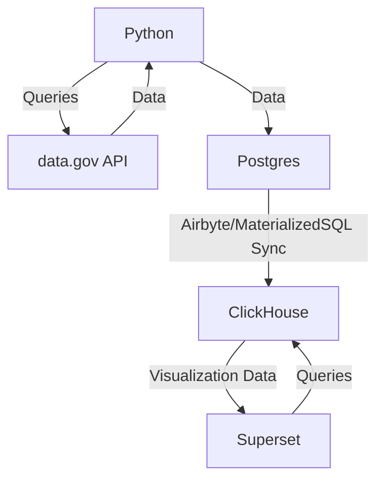

# data-gov-project
This is a Python application that fetches data from the [data.gov.gr repository](https://data.gov.gr/search/) using its API and inserts them to a **PostgreSQL** database for analysis. Tables that are regularly updated are synced to ClicHouse for faster OLAP either with Airbyte, or ClickHouse materialized PostgreSQL engine.

# Architecture

# How to use

## Command line
`python3.12 data_gov.py --token YOUR_TOKEN --dataset mdg_emvolio --table-name covid_vaccination_data --postgres-schema POSTGRES_SCHEMA --postgres-host HOST_NAME --postgres-user POSTGRES_USER --postgres-password POSTGRES_PASSWORD --postgres-database POSTGRES_DATABASE --date-from YYYY-MM-DD --date-to YYYY-MM-DD --sleep-seconds SLEEP_SECONDS --interval-days INTERVAL_DAYS --max-requests MAX_REQUESTS`
## automation_script.sh
This script automates the process of running for many datasets/tables, allowing the user faster crawling.
## Token
Register here for a token: [data.gov.gr page](https://www.data.gov.gr/token/)
## Docker 
The databases can be containerized via the `docker-compose.yaml` file included. There are 2 containers:
- `db`: Runs the latest PostgreSQL Docker image. Uses the `init.sql` script for initialization. 
- `clickhouse`: Runs the latest ClickHouse database for fast analysis.
For `superset` and `airbyte`, install them using the official documentation as they require some configuration.
Prepare an `.env` file with the following structure (modify accordingly):
```
POSTGRES_PASSWORD=YOUR_POSTGRES_PASSWORD
POSTGRES_USER=YOUR_POSTGRES_USER
POSTGRES_DB=YOUR_POSTGRES_DB
CLICKHOUSE_PASSWORD=YOUR_CLICKHOUSE_PASSWORD
```
Modify the `docker-compose.yaml` and the `init.sql` files according to your needs, then run `docker-compose --env-file .env up`.
## Configurations
### .env
This is the environment file that controls the variables that will be used for the docker containers. 
### init.sql
This is the script that will be run on startup from the PostgreSQL Docker container. It can be used to preconfigure the users, passwords, tables etc. 
### Materialized PostgreSQL Engine
After connecting to ClickHouse via the client, you can sync data between Postgres and ClickHouse (run on ClickHouse):
```
CREATE DATABASE IF NOT EXISTS data_gov
ENGINE = MaterializedPostgreSQL('localhost:5432', 'data_gov', 'postgres', 'POSTGRES_PASSWORD')
SETTINGS materialized_postgresql_schema = 'data_gov'
```
# Remarks
1. Backend can struggle to serve multiple requests, thus a conservative approach is used (2 async tasks, 10 seconds sleep interval).
2. Most datasets are small in size and there are no performance issues with simply running Postgres. However, ClickHouse is faster for OLAP, and will scale better as data grows.
3. First version of the project used a MySQL database for fast prototyping, but I faced several networking and permission issues with it. I decided migrating to PostgreSQL which I generally find superior to it. The init.sql provided originates from `pg_dump`, after migrating the data from MySQL to postgres with `pgloader`.


## Example SQL Queries (to be updated)
```
SELECT subquery.date, SUM(subquery.max_totaldistinctpersons) as total_max_totaldistinctpersons
FROM (
    SELECT DATE(referencedate) as date, area, MAX(totaldistinctpersons) as max_totaldistinctpersons
    FROM data_gov.covid_vaccination_data
    GROUP BY date, area
) as subquery
GROUP BY subquery.date;
```

# Normalizing the schema
There is a lot of data duplication on table groups like the ktm_, minedu ones. These can be normalized to a more efficient schema (WIP)

# WIP
* Data validation step (cleansing before inserting to Postgres -> probably saving the records as CSV first). 
* Data transformation step, if needed.
* Data normalization step.
